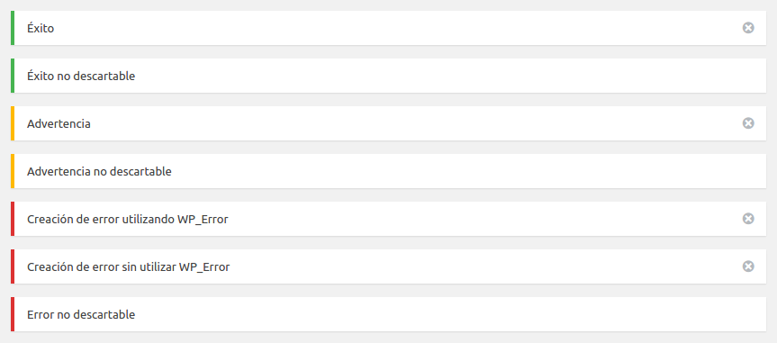

# PHP WordPress Notice library

[](https://packagist.org/packages/josantonius/wp-notice) [](https://packagist.org/packages/josantonius/wp-notice) [](https://packagist.org/packages/josantonius/wp-notice) [](https://packagist.org/packages/josantonius/wp-notice)

[English version](README.md)

Carga de complemento de dominio de texto para traducciones.

---

- [Instalación](#instalación)
- [Requisitos](#requisitos)
- [Cómo empezar y ejemplos](#cómo-empezar-y-ejemplos)
- [Uso](#uso)
- [TODO](#todo)
- [Contribuir](#contribuir)
- [Repositorio](#repositorio)
- [Licencia](#licencia)
- [Copyright](#copyright)

---

### Instalación 

La mejor forma de instalar esta extensión es a través de [composer](http://getcomposer.org/download/).

Para instalar PHP WordPress Notice library, simplemente escribe:

    $ composer require Josantonius/WP-Notice

El comando anterior sólo instalará los archivos necesarios, si prefieres descargar todo el código fuente (incluyendo tests, directorio vendor, excepciones no utilizadas, documentos...) puedes utilizar:

    $ composer require Josantonius/WP-Notice --prefer-source

También puedes clonar el repositorio completo con Git:

	$ git clone https://github.com/Josantonius/WP-Notice.git
	
### Requisitos

Esta ĺibrería es soportada por versiones de PHP 5.6 o superiores y es compatible con versiones de HHVM 3.0 o superiores.

Para utilizar esta librería en HHVM (HipHop Virtual Machine) tendrás que activar los tipos escalares. Añade la siguiente ĺínea "hhvm.php7.scalar_types = true" en tu "/etc/hhvm/php.ini".

### Cómo empezar y ejemplos

Para utilizar esta librería, simplemente:

```php
require __DIR__ . '/vendor/autoload.php';

use Josantonius\WP\Notice\Notice;
```
### Uso

Ejemplo de uso para esta librería:

```php
<?php
require __DIR__ . '/vendor/autoload.php';

use Josantonius\WP\Notice\Notice;

add_action('admin_notices', 'Notice::display');

Notice::success('Éxito');
Notice::success('Éxito no descartable', false);

Notice::warning('Advertencia');
Notice::warning('Advertencia no descartable', false);

$error = new \WP_Error('error', 'Creación de error utilizando WP_Error');

Notice::error($error);
Notice::error('Creación de error sin utilizar WP_Error');
Notice::error('Error no descartable', false);
```



### ☑ TODO

- [ ] Agregar tests

### Contribuir
1. Comprobar si hay incidencias abiertas o abrir una nueva para iniciar una discusión en torno a un fallo o función.
1. Bifurca la rama del repositorio en GitHub para iniciar la operación de ajuste.
1. Escribe una o más pruebas para la nueva característica o expón el error.
1. Haz cambios en el código para implementar la característica o reparar el fallo.
1. Envía pull request para fusionar los cambios y que sean publicados.

Esto está pensado para proyectos grandes y de larga duración.

### Repositorio

Los archivos de este repositorio se crearon y subieron automáticamente con [Reposgit Creator](https://github.com/Josantonius/BASH-Reposgit).

### Licencia

Este proyecto está licenciado bajo **licencia MIT**. Consulta el archivo [LICENSE](LICENSE) para más información.

### Copyright

2017 Josantonius, [josantonius.com](https://josantonius.com/)

Si te ha resultado útil, házmelo saber :wink:

Puedes contactarme en [Twitter](https://twitter.com/Josantonius) o a través de mi [correo electrónico](mailto:hello@josantonius.com).