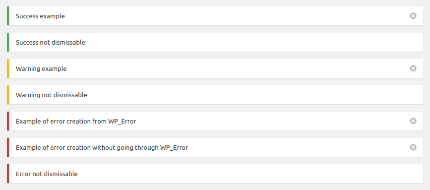

# PHP WordPress Notice

[](https://packagist.org/packages/josantonius/wp_notice) [](https://packagist.org/packages/josantonius/wp_notice) [](https://packagist.org/packages/josantonius/wp_notice) [](https://packagist.org/packages/josantonius/wp_notice)

[Versión en español](README-ES.md)

Display notices in WordPress administration panel.

---

- [Installation](#installation)
- [Requirements](#requirements)
- [Quick Start and Examples](#quick-start-and-examples)
- [Usage](#usage)
- [TODO](#todo)
- [Contribute](#contribute)
- [Repository](#repository)
- [License](#license)
- [Copyright](#copyright)

---

<p align="center"><strong>Take a look at the code</strong></p>

<p align="center">
  <a href="" title="Take a look at the code">
  	
  </a>
</p>

---

### Installation

The preferred way to install this extension is through [composer](http://getcomposer.org/download/).

To install PHP Wordpress Notice library, simply:

    $ composer require Josantonius/WP_Notice

The previous command will only install the necessary files, if you prefer to download the entire source code (including tests, vendor folder, exceptions not used, docs...) you can use:

    $ composer require Josantonius/WP_Notice --prefer-source

Or you can also clone the complete repository with Git:

	$ git clone https://github.com/Josantonius/WP_Notice.git
	
### Requirements

This library is supported by PHP versions 5.6 or higher and is compatible with HHVM versions 3.0 or higher.

To use this library in HHVM (HipHop Virtual Machine) you will have to activate the scalar types. Add the following line "hhvm.php7.scalar_types = true" in your "/etc/hhvm/php.ini".

### Quick Start and Examples

To use this class, simply:

```php
require __DIR__ . '/vendor/autoload.php';

use Josantonius\WP_Notice\WP_Notice;
```
### Usage

Example of use for this library:

```php
<?php
require __DIR__ . '/vendor/autoload.php';

use Josantonius\WP_Notice\WP_Notice;

WP_Notice::success('Success example');
WP_Notice::success('Success not dismissable', false);

WP_Notice::warning('Warning example');
WP_Notice::warning('Warning not dismissable', false);

$error = new \WP_Error('error', 'Example of error creation from WP_Error');

WP_Notice::error($error);
WP_Notice::error('Example of error creation without going through WP_Error');
WP_Notice::error('Error not dismissable', false);
```



### ☑ TODO

- [ ] Add tests

### Contribute
1. Check for open issues or open a new issue to start a discussion around a bug or feature.
1. Fork the repository on GitHub to start making your changes.
1. Write one or more tests for the new feature or that expose the bug.
1. Make code changes to implement the feature or fix the bug.
1. Send a pull request to get your changes merged and published.

This is intended for large and long-lived objects.

### Repository

All files in this repository were created and uploaded automatically with [Reposgit Creator](https://github.com/Josantonius/BASH-Reposgit).

### License

This project is licensed under **MIT license**. See the [LICENSE](LICENSE) file for more info.

### Copyright

2017 Josantonius, [josantonius.com](https://josantonius.com/)

If you find it useful, let me know :wink:

You can contact me on [Twitter](https://twitter.com/Josantonius) or through my [email](mailto:hello@josantonius.com).